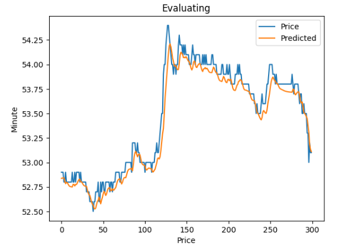
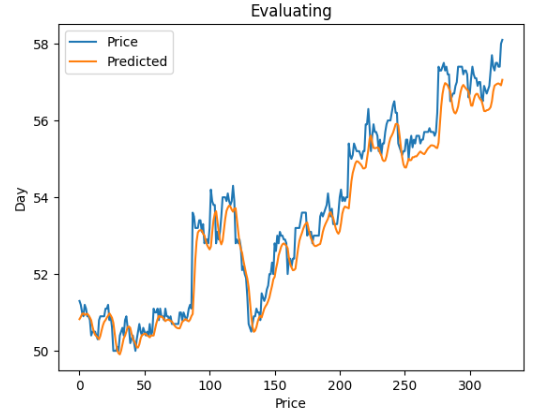
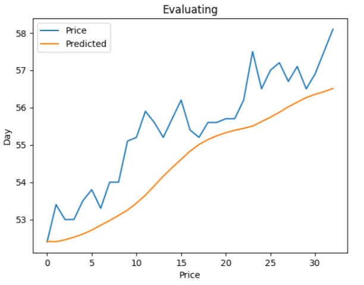
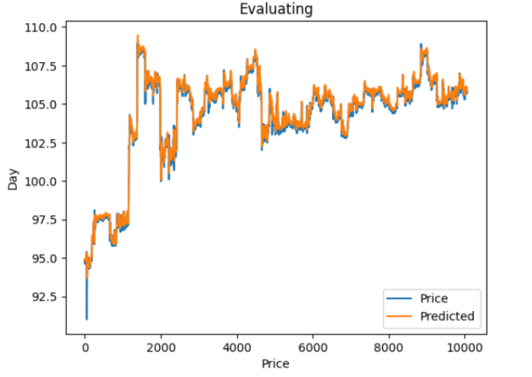
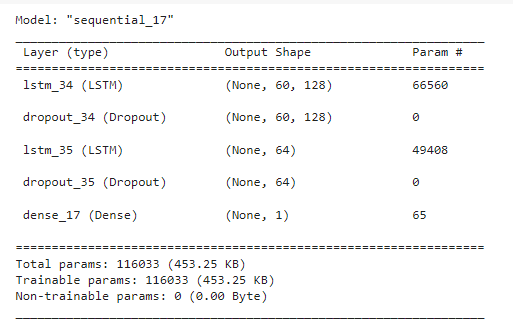

# LSTM-for-predict-stock-prices

### Data & pre-process
- ```(Datetime, Open, High, Low, Close, Volume)``` by minute of FPT, VIC, MSN and PNJ.
- Pre-process: scaled by MinMaxScaler.

### Training LSTM & Evaluating
- Predicting FPT prices by minute (data in 60 minute for predicting the next minute).

$RMSE \approx 0.162 kVND$



- Predicting FPT prices by hour (data in 45 hour for predicting the next hour).

$RMSE \approx 0.514 kVND$



- Predicting FPT prices by day (data in 30 day for predicting the next day).

$RMSE \approx 1.105 VND$



- Predicting VIC prices by minute (data in 60 minute for predicting the next minute).

$RMSE \approx 0.275 VND$



- Use the same model for MSN and PNJ stocks.

### Architecture



### Hyperparameters
- Optimizer: Adam.
- Loss: mean_squared_error.
- Metric: RMSE.
